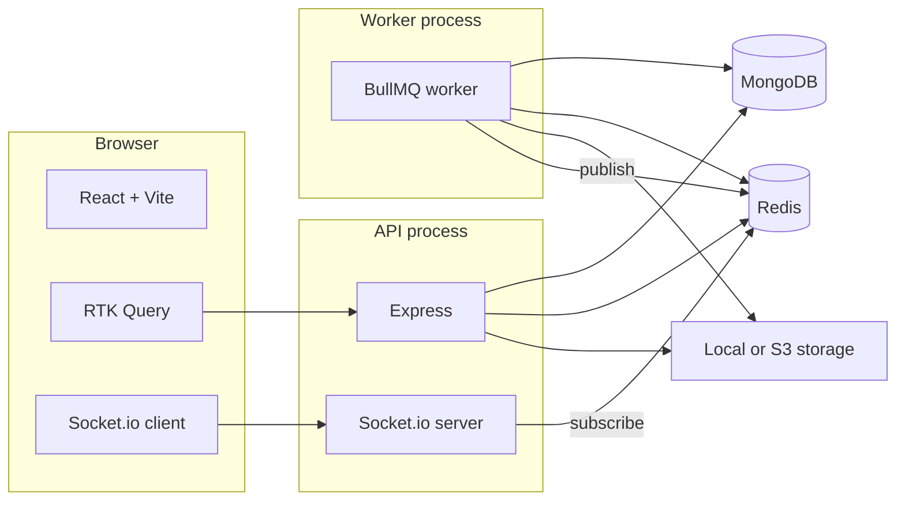

# Pulse

Full-stack video platform: upload, background processing (mock FFmpeg + pluggable sensitivity), HTTP streaming with range support, and real-time status over Socket.io.

---

## User manual

### What you need

- **Node.js** 20 LTS (or current LTS)
- **Docker** (recommended) for MongoDB and Redis, or your own instances

### First-time setup

1. Copy environment template and adjust secrets:

   ```bash
   cp .env.example .env
   ```

   Set at least **`MONGODB_URI`**, **`REDIS_URL`**, and a strong **`JWT_SECRET`**. See [Environment variables](#environment-variables).

2. Start databases:

   ```bash
   docker compose up -d
   ```

3. Install dependencies:

   ```bash
   cd backend && npm install
   cd ../frontend && npm install
   ```

### Running locally (three terminals)

| Terminal | Directory | Command | Purpose |
|----------|-----------|---------|---------|
| 1 | `backend/` | `npm run dev` | HTTP API + Socket.io |
| 2 | `backend/` | `npm run worker` | BullMQ consumer (video processing) |
| 3 | `frontend/` | `npm run dev` | Vite SPA (proxies `/api` and `/socket.io`) |

- **API base URL:** `http://localhost:4000`  
- **App URL:** `http://localhost:5173`  
- **Health:** `GET http://localhost:4000/api/health`

### Using the app

1. Open the SPA and **Register** to create an account, organization, and admin membership.
2. **Save the organization ID** shown after registration; you need it to **Log in** on other browsers or after clearing storage.
3. **Dashboard:** list videos, filter by status and duration (query params are reflected in the URL).
4. **Upload (editor/admin):** pick a file → the app creates a pending video then uploads via multipart (`POST /videos/:id/upload`).
5. **Video detail:** open a row; when status is **completed**, the player loads the stream with your JWT. Live processing updates arrive over Socket.io (subscribe after opening the page).

### Production notes

- Run API and **worker** as separate processes (or containers); both need the same `MONGODB_URI`, `REDIS_URL`, and storage configuration.
- Use distinct **`JWT_SECRET`** and **`JWT_REFRESH_SECRET`** in production.
- For large files, replace the SPA’s blob-based player with ranged streaming or signed URLs (see [Assumptions and design decisions](#assumptions-and-design-decisions)).

---

## Architecture overview

### High-level diagram



- **Tenant:** each **Organization** is a tenant; **Membership** ties users to orgs with roles **viewer**, **editor**, **admin**.
- **Auth:** access JWT encodes `userId`, `organizationId`, and `role` for that org. Refresh tokens are JWTs tracked server-side (hashed in Mongo) for revocation.
- **Videos:** documents are always queried with `organizationId` from the token — never from an untrusted client org field.
- **Queue:** `video-processing` queue; worker skips work when the video is already **completed** (idempotent terminal state).
- **Real time:** workers `PUBLISH` events on Redis; the API process `SUBSCRIBE`s and emits to Socket.io rooms `video:{videoId}` after clients call `video:subscribe`.

### Repository layout

| Path | Role |
|------|------|
| `backend/src/modules/` | Feature modules: `auth`, `videos`, `orgs` — routes → controllers → **services** (business logic) |
| `backend/src/infrastructure/` | DB models, Redis/BullMQ, storage providers, FFmpeg mock, sensitivity interface, socket wiring |
| `backend/src/middleware/` | JWT auth, RBAC (`requireRole`), Zod validation, errors |
| `backend/src/shared/` | Shared errors, HTTP range parsing |
| `backend/src/workers/` | BullMQ worker entrypoint |
| `frontend/src/lib/` | `api/` (RTK + reauth), `socket/`, `upload/` abort registry |
| `frontend/src/features/` | `auth`, `videos`, `upload` (UI state slice) |
| `frontend/src/app/` | Router shell, protected routes |

---

## Assumptions and design decisions

| Decision | Rationale |
|----------|-----------|
| **Organization as tenant** | Single active org per access token simplifies RBAC and guarantees every query can filter by one `organizationId`. |
| **No business logic in routes or controllers** | Controllers map HTTP only; services own rules and orchestration — easier tests and reuse. |
| **Refresh via plain `fetch` in RTK base query** | Avoids sending a stale `Authorization` header on refresh calls. |
| **Redis pub/sub for worker → API sockets** | API and worker are different processes; no in-memory coupling. |
| **Local “presigned” upload** | Simulates S3 flow: opaque upload token + POST to API; production uses real presigned PUT when `STORAGE_DRIVER=s3`. |
| **FFmpeg + sensitivity mocked** | Keeps CI/dev free of native binaries; interfaces allow swapping real implementations. |
| **SPA video playback via blob** | Simple and works with header-based JWT for small files; not ideal for very large assets without range/MediaSource or signed URLs. |
| **`any` discouraged** | TypeScript strict; Mongoose `.lean<>()` generics used for tenant queries. |

---

## API documentation

Base path: **`/api`**. Unless noted, request bodies are **JSON** with `Content-Type: application/json`.

### Error format

Failed requests return JSON:

```json
{
  "code": "NOT_FOUND",
  "message": "Video not found",
  "details": { }
}
```

- **`VALIDATION_ERROR`** / HTTP **422** — Zod validation (`details` often has `fieldErrors`).
- **`RANGE_NOT_SATISFIABLE`** / HTTP **416** — invalid `Range` for stream; `Content-Range: bytes */<size>` may be set.

### Authentication

Protected routes expect:

```http
Authorization: Bearer <access_jwt>
```

Login and register responses include **`accessToken`**, **`refreshToken`**, **`organizationId`**, **`role`**.

---

### `GET /api/health`

Public. **200** — `{ "ok": true, "service": "pulse-api" }`.

---

### `POST /api/auth/register`

Public.

**Body:**

| Field | Type | Rules |
|-------|------|--------|
| `email` | string | email |
| `password` | string | min 8 |
| `organizationName` | string | 1–200 chars |

**201** — Same token shape as login.

---

### `POST /api/auth/login`

Public.

**Body:**

| Field | Type |
|-------|------|
| `email` | string |
| `password` | string |
| `organizationId` | string (Mongo ObjectId) |

**200** — `{ accessToken, refreshToken, organizationId, role }`.

---

### `POST /api/auth/refresh`

Public.

**Body:** `{ refreshToken, organizationId }`

**200** — New `{ accessToken, refreshToken, organizationId, role }`.

---

### `POST /api/auth/logout`

Public (but typically called with a valid session).

**Body:** `{ refreshToken }`

**204** — Refresh token row revoked.

---

### Videos (all require `Authorization`)

#### `GET /api/videos`

**RBAC:** viewer+

**Query (optional):**

| Param | Description |
|-------|-------------|
| `status` | `pending` \| `processing` \| `completed` \| `failed` |
| `minDurationSec` | number (filters by metadata duration when present) |
| `maxDurationSec` | number |

**200** — JSON array of video documents (scoped to org).

---

#### `POST /api/videos`

**RBAC:** editor+

**Body (optional):** `{ originalFilename?: string }`

**201** — `{ id: string }` (Mongo id of pending video).

---

#### `POST /api/videos/:id/upload`

**RBAC:** editor+

**Body:** `multipart/form-data` with field **`file`** (max ~500 MB in config).

**200** — `{ videoId, storageKey }` — enqueues processing.

---

#### `POST /api/videos/presigned-upload`

**RBAC:** editor+

**Body:** `{ originalFilename, contentType? }` (default `video/mp4`).

**201** — Instructions: `videoId`, `uploadToken`, `method`, `url`, `storageKey`, optional `headers` / `fields`.

- **Local:** POST file to `url` with `Authorization` and header **`x-upload-token: <uploadToken>`**.
- **S3:** PUT body to presigned `url`; then **`POST /api/videos/complete-upload`**.

---

#### `POST /api/videos/presigned-blob/:videoId`

**RBAC:** editor+

**Body:** `multipart/form-data`, field **`file`**. Headers: **`x-upload-token`** as returned from presigned-upload.

**204** — File stored; processing enqueued.

---

#### `POST /api/videos/complete-upload`

**RBAC:** editor+

**Body:** `{ videoId, storageKey }` — verifies object exists (S3 HEAD / local stat); enqueues processing.

**204**

---

#### `GET /api/videos/:id`

**RBAC:** viewer+

**200** — Video document (org-scoped).

---

#### `GET /api/videos/:id/stream`

**RBAC:** viewer+

Supports **`Range: bytes=...`**. **200** full body or **206** partial; `Accept-Ranges: bytes`.

---

### Socket.io (same host/port as API)

- **Handshake:** `auth: { token: "<access_jwt>" }`
- **Client → server:** `emit('video:subscribe', videoId, callback?)` — server checks org ownership before joining `video:{videoId}`.
- **Server → client:**
  - `processing_progress` — `{ videoId, progress }`
  - `processing_completed` — `{ videoId }`
  - `processing_failed` — `{ videoId, error }`

Path defaults to **`/socket.io`** (configure client accordingly).

---

## Environment variables

See **[`.env.example`](.env.example)** for the full list. Required for a typical local run:

| Variable | Example | Notes |
|----------|---------|--------|
| `MONGODB_URI` | `mongodb://127.0.0.1:27017/pulse` | Or Atlas URI |
| `REDIS_URL` | `redis://127.0.0.1:6379` | BullMQ + pub/sub |
| `JWT_SECRET` | long random string | Signs access tokens |
| `CORS_ORIGIN` | `http://localhost:5173` | Comma-separated allowed origins |
| `PUBLIC_API_URL` | `http://localhost:4000` | Used in local presigned upload URLs |
| `UPLOAD_DIR` | `uploads` | Relative to `backend/` cwd for local storage |
| `STORAGE_DRIVER` | `local` or `s3` | S3 needs bucket/region/credentials |

Backend reads **repo-root `.env`** first (see `backend/src/config/env.ts`).

Frontend (optional):

| Variable | Purpose |
|----------|---------|
| `VITE_WS_URL` | Override Socket.io origin if API is not proxied |

---

## Code quality

| Practice | Where |
|----------|--------|
| **Strict TypeScript** | Backend `tsconfig` strict; frontend `strict`; avoid `any` in new code |
| **Validation** | Zod on request bodies/queries; consistent `AppError` mapping |
| **Layering** | No domain rules in Express routes or React “god components”; hooks orchestrate, RTK Query owns server state |
| **Security** | Multi-tenant filters on every video query; RBAC middleware; refresh token hashing |
| **Lint** | `npm run lint` in `backend/` and `frontend/` |

---

## Git (reference)

```bash
git remote add origin <your-remote-url>
git push -u origin main
```
