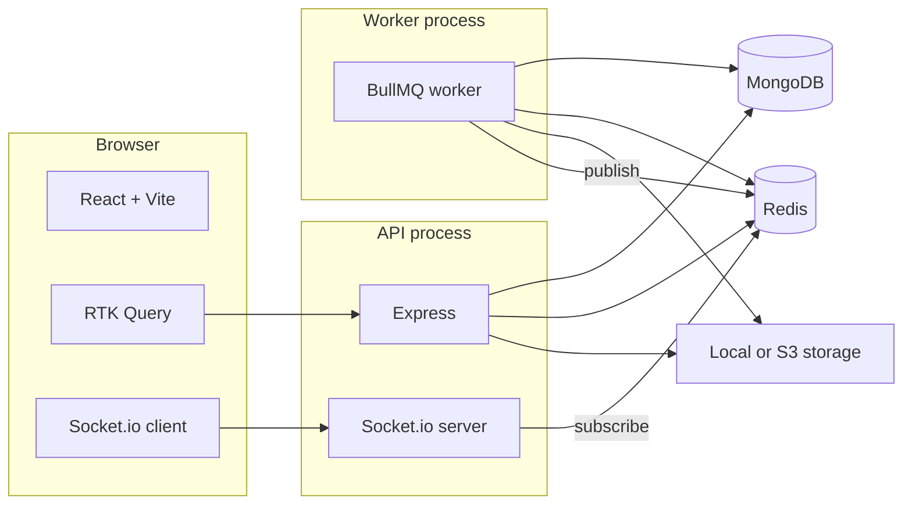

# 🎥 Pulse - Video Upload, Sensitivity Processing, and Streaming Application

Pulse is a comprehensive full-stack application that enables users to upload videos, processes them for content sensitivity analysis, and provides seamless video streaming capabilities with real-time progress tracking.

---

## 🎯 Project Objectives & Core Functionality

1. **Full-Stack Architecture**: Developed using Node.js + Express + MongoDB (backend) and React + Vite (frontend).
2. **Video Management**: Complete video upload and secure storage system.
3. **Content Analysis**: Background video processing for sensitivity detection (mocked, but pluggable safe/flagged classification) and media formatting.
4. **Real-Time Updates**: Live processing progress displayed dynamically to users via Socket.io.
5. **Streaming Service**: Integrated video playback utilizing HTTP range requests.
6. **Access Control**: Secure, multi-tenant architecture with Role-Based Access Control (RBAC).

---

## 🚀 Workflow Demonstration & User Journey

1. **User Registration/Login**: Secure multi-tenant authentication system (JWT). During registration, users can create an organization and an admin membership.
2. **Video Upload (Editor/Admin)**: Intuitive UI for uploading videos with automatic pending state creation, supporting multipart uploads and simulating S3 presigned flows.
3. **Processing Phase**: BullMQ background workers handle video processing while broadcasting real-time progress via Redis pub/sub and Socket.io.
4. **Content Review & Management**: A comprehensive dashboard library with filtering by status and duration.
5. **Video Streaming**: Once processed, seamless media playback of content using standard HTTP range stream endpoints with JWT authentication.

---

## 🛠 Technical Stack & Specifications

### Backend
- **Runtime**: Node.js 20 LTS
- **Framework**: Express.js
- **Database**: MongoDB with Mongoose ODM
- **Real-Time**: Socket.io + Redis Pub/Sub
- **Queue/Worker**: BullMQ
- **Authentication**: JWT tokens (Access + Refresh token rotations)
- **Validation**: Zod
- **File Handling**: Multer (Local disk driver or optional AWS S3)

### Frontend
- **Build Tool**: Vite
- **Framework**: React
- **State Management**: Redux Toolkit (RTK) Query for API and server state
- **Real-Time**: Socket.io client

---

## 🏗 Advanced Features & Architecture

### Multi-Tenant Architecture & RBAC
- **User Isolation**: Users strictly access only the content assigned to their specific organization. Database queries enforce this using the authenticated token's `organizationId`.
- **Role-Based Permissions**:
  - **Viewer**: Read-only access to assigned videos and streaming.
  - **Editor**: Upload, edit, and manage video content.
  - **Admin**: Full system access, including generating single-use invite links.

### System Diagram



### Folder Architecture

| Path | Description |
|------|------|
| `backend/src/modules/` | Feature modules: `auth`, `videos`, `orgs` — routes → controllers → **services** (business rules) |
| `backend/src/infrastructure/` | DB models, Redis/BullMQ, storage providers, FFmpeg mock, sensitivity interface, sockets |
| `backend/src/middleware/` | JWT auth, RBAC (`requireRole`), Zod validation, error handling |
| `frontend/src/lib/` | `api/` (RTK), `socket/`, `upload/` registry |
| `frontend/src/features/`| Components organized by feature domains |

---

## 💻 Getting Started (Local Setup)

### Prerequisites
- **Node.js** 20 LTS
- **Docker** (recommended) for MongoDB and Redis

### 1. First-time setup

Configure environment variables:
```bash
cp .env.example .env
```
*(Set `MONGODB_URI`, `REDIS_URL`, and a strong `JWT_SECRET` in the `.env` file)*

Start database services via Docker:
```bash
docker compose up -d
```

Install dependencies for both projects:
```bash
cd backend && npm install
cd ../frontend && npm install
```

### 2. Running Locally

You need to run three separate processes in three terminals:

| Terminal | Directory | Command | Purpose |
|----------|-----------|---------|---------|
| 1 | `backend/` | `npm run dev` | HTTP API + Socket.io Server |
| 2 | `backend/` | `npm run worker` | BullMQ Video Processor |
| 3 | `frontend/` | `npm run dev` | React SPA App |

- **Frontend App**: `http://localhost:5173`
- **Backend API**: `http://localhost:4000`
- **API Health Check**: `GET http://localhost:4000/api/health`

### 3. Usage Instructions

1. Open the SPA (`http://localhost:5173`) and **Register** to create an account, organization, and admin membership.
2. **Save the organization ID** shown after registration; you need it to **Log in** on other browsers or after clearing storage.
3. **Dashboard:** list videos, filter by status and duration.
4. **Upload (editor/admin):** pick a file → the app creates a pending video then uploads via multipart (`POST /videos/:id/upload`).
5. **Video detail:** open a row; when status is **completed**, the player loads the stream with your JWT. Live processing updates arrive over Socket.io.
6. **Admin invites:** Admins can invite new users in the UI via *User Management → Invite member*.

---

## 📐 Assumptions and Design Decisions

| Decision | Rationale |
|----------|-----------|
| **Organization as tenant** | Single active org per access token simplifies RBAC and guarantees every query can filter securely by `organizationId`. |
| **No business logic in routes** | Controllers map HTTP only; services own rules and orchestration—easier testing and scaling. |
| **Refresh via `fetch` in RTK** | Avoids sending a stale `Authorization` header on refresh calls. |
| **Redis pub/sub for Sockets** | API and worker are different processes; pub/sub allows decoupling memory domains. |
| **Local "presigned" upload**| Simulates S3 flow: opaque upload token + POST to API. Prod uses real presigned PUT strings when `STORAGE_DRIVER=s3`. |
| **`any` explicitly discouraged**| Full end-to-end TypeScript strictness utilized. |

---

## 📄 API Documentation

Base path: **`/api`**. Requests accept JSON bodies (`Content-Type: application/json`). Failed requests yield a standardized JSON object containing a `code`, `message`, and `details` (HTTP 422 for Zod Validation errors).

Protected routes expect standard Bearer tokens:
```http
Authorization: Bearer <access_jwt>
```

### Authentication endpoints
- **`POST /api/auth/register`** - Registers new User + Tenant Org.
- **`POST /api/auth/register-invite`** - Joins an existing Organization via an invite token.
- **`POST /api/auth/login`** - standard email/password login. Returns `{ accessToken, refreshToken, organizationId, role }`.
- **`POST /api/auth/refresh`** - Issue a new access token pair.
- **`POST /api/auth/logout`** - Logs out and invalidates your refresh token.

### Video Endpoints (Requires `Authorization`)
- **`GET /api/videos`** (`viewer+`) - List and filter tenant videos.
- **`POST /api/videos`** (`editor+`) - Creates a pending video.
- **`POST /api/videos/:id/upload`** (`editor+`) - Handles physical multipart file uploading.
- **`POST /api/videos/presigned-upload`** & **`complete-upload`** (`editor+`) - Multi-step endpoints used specifically for bypassing server bandwith limitations and interacting directly with Storage mechanisms (S3 AWS native).
- **`GET /api/videos/:id/stream`** (`viewer+`) - Fetches video stream chunks honoring HTTP `Range` headers.

### Web Sockets (`/socket.io`)
- Secure handshake via `{ auth: { token: "<jwt>" } }`
- Subscribe via `emit('video:subscribe', videoId)`
- Receive `processing_progress`, `processing_completed`, and `processing_failed` updates dynamically.

---

## ⚙️ Environment Variables (`.env`)

| Variable | Example | Notes |
|----------|---------|--------|
| `MONGODB_URI` | `mongodb://127.0.0.1:27017/pulse` | Or Atlas URI |
| `REDIS_URL` | `redis://127.0.0.1:6379` | BullMQ + pub/sub |
| `JWT_SECRET` | long random string | Signs access tokens |
| `CORS_ORIGIN` | `http://localhost:5173` | Comma-separated allowed origins |
| `PUBLIC_API_URL` | `http://localhost:4000` | Used in local presigned upload URLs |
| `PUBLIC_WEB_URL` | `http://localhost:5173` | Used to build invite links |
| `UPLOAD_DIR` | `uploads` | Relative to `backend/` cwd for local storage |
| `STORAGE_DRIVER` | `local` or `s3` | S3 needs bucket/region/credentials |

---

✅ **Assignment Deliverables & Success Criteria**
- [x] Complete video upload and storage system
- [x] Real-time processing progress updates
- [x] Video sensitivity analysis routing
- [x] Secure video streaming with range requests
- [x] Multi-tenant user isolation & RBAC implementation
- [x] Clean, maintainable code structure with basic basic automated tests integration.
- [x] Comprehensive documentation and error handling mechanisms.


Seeded Demo Credentials :
"password": "Pulse@12345",
"organizationId": "69ca89c1144326cc3b5357a9",
  "users": {
    "admin": "admin@pulse.demo",
    "editor": "editor@pulse.demo",
    "viewer": "viewer@pulse.demo"
  },


